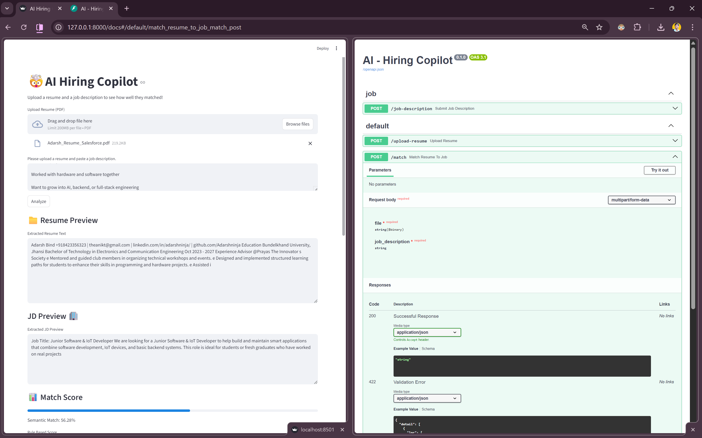

🧠 AI Hiring Copilot

An end-to-end AI system that reads resumes, understands job descriptions, and acts like a technical recruiter — all running locally on your own machine.

🚀 What is AI Hiring Copilot?

AI Hiring Copilot is a full-stack AI application that:

Reads PDF resumes (even scanned ones using OCR)

Understands job descriptions

Uses machine learning embeddings to compare meaning

Uses a local LLaMA-3 model to think like a recruiter

Gives:

Match scores

Skill gaps

Resume improvement tips

Interview questions

All without sending data to the cloud.

🧠 How It Works (High Level)
Resume PDF
   ↓
OCR / PDF Parser
   ↓
Text Cleaning
   ↓
Skill Extraction (Rule-Based)
   ↓
Chunked Embeddings (MiniLM)
   ↓
Semantic Similarity
   ↓
Local LLaMA-3 (Ollama)
   ↓
Recruiter-Style Feedback

This hybrid approach combines:

ATS-style keyword matching

Neural semantic understanding

LLM reasoning

Just like modern hiring platforms.

🖥 Tech Stack
Layer	Technology
Frontend	Streamlit
Backend	FastAPI
Embeddings	SentenceTransformers (MiniLM)
Similarity	Cosine Similarity
LLM	LLaMA-3 (via Ollama)
OCR	Tesseract
PDF Parsing	PyMuPDF
Language	Python
🎯 Features

📄 Upload any resume (PDF or scanned)

📝 Paste a job description

📊 Get:

Rule-based ATS score

Semantic AI score

🧠 See:

Matched skills

Missing skills

🤖 Receive:

AI recruiter explanation

Resume improvement plan

Interview questions

🔒 Fully local — no API keys, no cloud

🖼 Application Preview

### Upload Resume & Job Description

### AI Hiring Copilot Result

🛠 How to Run Locally
1️⃣ Clone the repo
git clone https://github.com/yourusername/ai-hiring-copilot
cd ai-hiring-copilot

2️⃣ Create virtual environment
python -m venv venv
venv\Scripts\activate
pip install -r requirements.txt

3️⃣ Run Ollama

Install from https://ollama.com

ollama pull llama3
ollama run llama3

(Keep this running)

4️⃣ Start backend
uvicorn app.main:app --reload

5️⃣ Start frontend
streamlit run frontend/streamlit_app.py

Open browser → Enjoy 😈

🧪 Why This Project Is Different

Most ML projects stop at:

“I trained a model.”

This one:

Ingests messy real-world data

Uses embeddings and vector math

Runs a real LLM

Has a real UI

Solves a real hiring problem

It’s built like a startup-grade AI system, not a Kaggle notebook.

👨‍💻 Author

Adarsh
Machine Learning & GenAI Engineer
Building real-world AI products 🚀